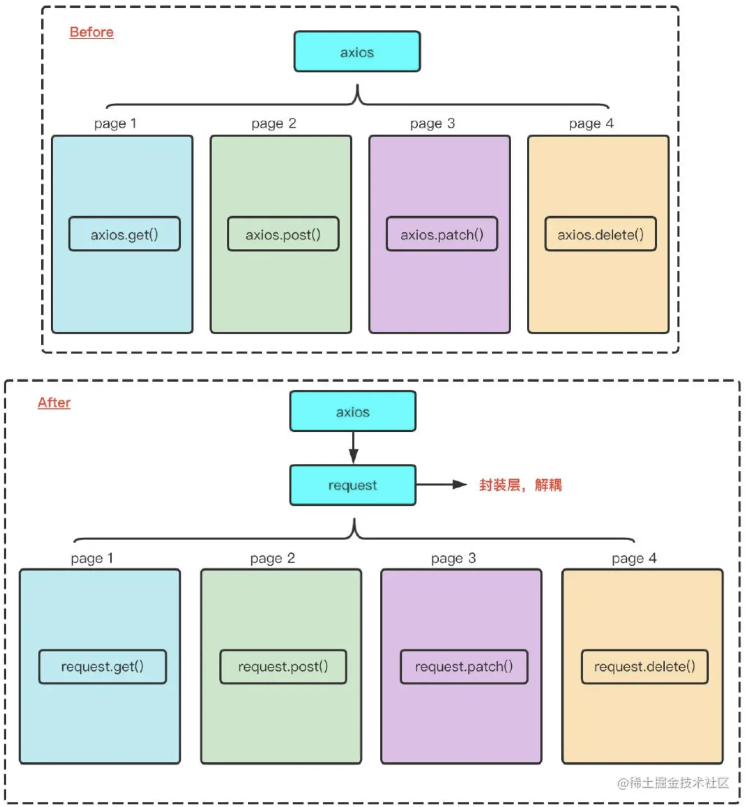

# axios
为什么要封装axios?
1. 直接用axios，依赖性太强，如果这个库不维护了，再去重构会很麻烦。
2. 一些公共的请求功能，每次请求都需要重新写配置
3. 将axios进行一层封装，将axios封装为自定义的request，将来直接使用request来发送网络请求就行，日后想要更换网络请求库，可以直接修改request层，这样非常方便，将一些公共的功能封装到requeset层，如网络请求头添加tkoen，加载loading效果等等。拦截器可以灵活封装等，
 

